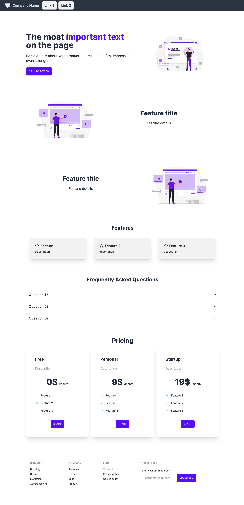

# Next.js TailwindCSS Landing Page Template

This is a Landing page template built with Next.js, TailwindCSS and DaisyUI. It is optimized for mobile and desktop devices.



## How to run this project

1. Clone this repository
2. Install Node.js
3. Install dependencies with `npm install`
4. Run the development server with `npm run dev`
5. Open [http://localhost:3000](http://localhost:3000) with your browser to see the result.

## Supported Sections and Features

Sections:
- Navbar
- Hero
- Features
- Pricing
- Footer

Features:
- Mobile and Desktop Optimized
- Dark mode and other themes
- SEO tags

In order to request new features, please open an issue.

## Landing Page Features

### Dark Mode and Other Themes


You can change the theme of the landing page. In the file `tailwind.config.js`, edit the following lines. Change 
`light` the one of the 
available [DaisyUI themes](https://daisyui.com/docs/themes/) (i.e. `dark` for dark theme).

```
daisyui: {
    themes: ["light"],
  }
```


### Icons

For the icons, we use [lucide-react](https://lucide.dev/icons/).


### SEO tags

In order to modify SEO tags like title and description, open `src/app/layout.tsx` and modify the `metadata` variable.